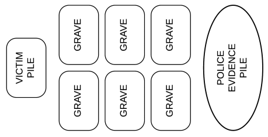

# Serial Killer
### *a dead simple card game*

## Goal

Kill, kill, kill!&mdash;but don't get caught.  The winner is the last serial killer on the loose!

## Requirements

1 standard deck of playing cards
6 counters per player (pennies, toothpicks, etc.)

## Card summary

* **Ace** &ndash; *informant*
* **King** &ndash; *victim*
* **Queen** &ndash; *victim*
* **Jack** &ndash; *corpse*
* Numbered cards - *missed opportunity!*

## Layout

## Gameplay

Each player gets 6 counters.  The counters are *clues*.  Once the police have all 6 of a player's *clues*, they identify the player as a serial killer, and arrested that player&mdash;the player is out of the game.  The last player with *clues* left is still “on the loose”, and wins the game.

To select who goes first: players draw a card at random from the shuffled deck.  High card will go first.  In case of a tie, players with tied cards draw again.

To start the game: shuffle the deck.  Place the deck in the “victim stack”.

The first player draws six cards from top of the victim stack, placing each into one of six “grave” piles.  (Arrange graves so that all players can reach them.)

Subsequent players will draw only as many cards as there are open graves.  Play proceeds clockwise.

A **King** or **Queen** is a *victim*.  If a player draws a *victim* and places it into a grave, the player has successfully killed that turn.  The grave that the victim goes into is now full, and no more cards will be placed in it.  Graves with numbered cards are still open&mdash;and proof that a player missed an opportunity to kill!

If a player does not draw a **King** or **Queen**, that player has failed to kill that turn.  The player's unsatisfied urge to kill will make the player distracted and sloppy, and so the police find a *clue* about the player's identity.

When the police find a *clue* about a player, one of that player's counters is moved to the “police investigation” pile.  When the police have collected all of the *clues* about a player&mdash;meaning the player has no counters left&mdash;they arrest the player, who is then out of the game.

**Jacks** and **Aces** are special cards.  Players are not required to immediately put a **Jack** or **Ace** into a grave; they are only put into a grave when the player chooses to do so.  The grave into which the card would have been placed when it was drawn gets skipped for that turn.

A **Jack** is a *corpse*.  Since the **Jack** is already dead, it fails to satiate a player's need to kill, so it does not prevent the player losing a *clue* to the police investigation pile. However, since the police are not investigating the death of the *corpse*, the player can choose to hold onto a *corpse* instead of burying it right away.

A player can use the *corpse* to close a grave, by putting the *corpse* into it.  A *corpse* can be played at the end of a turn of the player who drew the **Jack**.

An **Ace** is an *informant*.  An *informant* can either discredit a *clue* against the player playing the **Ace**, or can inform on another player.  When the *informant* discredits a *clue*, the player playing the **Ace** gets a counter back from the police investigation pile; when the *informant* informs on another player, that player loses a *clue* to the police investigation pile. 

To use an *informant*, there must be a victim.  If there are no victims, the *informant* cannot be played.  A *corpse* does not qualify as a victim, since there is no police investigation into the death of the *corpse*.  

When using an informant, the **Ace** is placed on top of a **King** or **Queen** in a grave.  A player can use an *informant* immediately when drawn, or can hold onto it.  A held *informant* can be played at the end of a turn of the player who drew the **Ace**.

Any special cards (*corpses* or *informants*) that a player is holding should be kept face up and plainly visible to the other players.

When all six of the graves are occupied by *victims* or *corpses*, reshuffle all of the unheld cards, both those in graves and in the victim stack.  (Special cards&mdash;*corpses* or *informants*&mdash;being held by players are not taken.)  The shuffled deck is placed back in the victim stack.  Play resumes where it left off.  There are once again six open graves to fill, so…

Get out there and kill, kill, kill!
